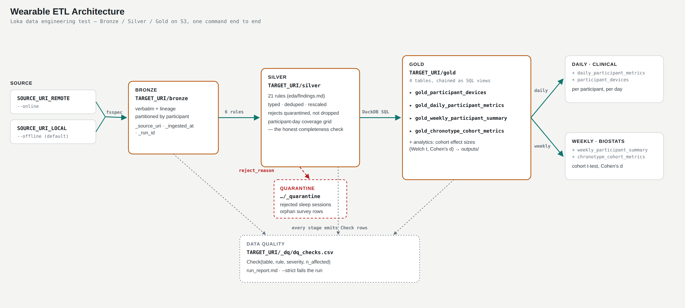

# Loka Data Engineering Test — Wearable ETL

Bronze → Silver → Gold pipeline built for the Loka data engineering technical
assessment: wearable health data (steps, heart rate, sleep, wellness survey)
for 50 participants over a 28-day study, landed and cleaned from a
deliberately messy JSON/CSV export into four analysis-ready Gold tables on S3.

## Architecture



Data flows left to right through the three S3 layers the pipeline owns (amber
outline) — Bronze lands the export verbatim, Silver applies the 21 ordered
defect rules, Gold rebuilds four tables with DuckDB — with two branches off to
the side: Silver's unrepairable rows go to a quarantine table instead of being
dropped (dashed), and every stage emits a data-quality check row into one
table that `--strict` can fail the run on (dotted). The two boxes on the right
are the pipeline's actual consumers: a daily clinical view and a weekly
biostatistics view, reading different Gold tables.

One command runs the whole thing — against a local mirror by default, or
against S3 with `--online`. Setup below.

## Repository layout

```
.
├── poc_run_etl.sh          # single entry point — bootstraps the venv, runs the pipeline
├── Makefile                 # shortcuts around poc_run_etl.sh (make pull / etl / offline / test / ...)
├── requirements.txt         # direct dependencies (input, version ranges)
├── requirements.lock.txt    # resolved dependencies (pip freeze, exact versions)
├── docs/
│   └── architecture.png     # pipeline diagram
├── eda/                      # exploration: findings, notebook, EDA outputs
│   ├── findings.md           # the 21 documented source-data defects — source of truth for every Silver rule
│   ├── 01_explore_raw.py / .ipynb
│   └── outputs/
└── poc/
    ├── .env                  # URIs + AWS settings for this machine (see Requirements)
    ├── .env.example           # template — copy to .env and fill in
    ├── scripts/pull_data.sh   # sync the raw export from S3 -> poc/data/raw
    ├── notebooks/             # browse Bronze/Silver/Gold in a notebook (local or S3)
    ├── infra/output-bucket.yaml  # CloudFormation for the output S3 bucket (see below)
    ├── etl/                   # the pipeline package
    │   ├── config.py          # settings, study constants, defect-rule constants
    │   ├── io_uri.py          # URI-agnostic (local path / s3://) read+write via fsspec
    │   ├── bronze.py          # land the source verbatim, add lineage
    │   ├── silver.py          # 21 defect rules, one function per rule, in dependency order
    │   ├── gold.py            # DuckDB SQL: 4 Gold tables + cohort analytics
    │   ├── quality.py         # pipeline assertions (the --strict gate)
    │   └── run_etl.py         # CLI entry point / orchestrator
    ├── sql/                   # the Gold + analytics DuckDB queries
    ├── tests/                 # unit tests for the Silver rules
    ├── data/                  # not committed — raw export, local lake, interim EDA parquet
    └── outputs/               # generated reports (dq_checks.csv, run_report.md, analytics CSVs)
```

`poc/data/` and the virtualenv (`.venv/`) are git-ignored. Most of
`poc/outputs/` is regenerated by every run; the specific report files that
are useful to diff across commits are tracked anyway (see `.gitignore`).

## Requirements

- **Python 3.10+**, reachable as `python3` (or point at a specific one — see
  below). `poc_run_etl.sh` creates and manages its own virtualenv at
  `.venv/`; there is nothing to `pip install` by hand.
- **bash** — the pipeline is driven entirely through `poc_run_etl.sh` /
  `make`, both tested on macOS's stock bash.
- **AWS CLI v2** — only needed to pull the raw data (below), deploy the
  output bucket, and for `--online` runs. Not needed at all for an offline
  run once the data is on disk.
- **Your own AWS account** — to create the output bucket the pipeline
  writes to. Any account with permission to create S3 buckets, bucket
  policies and CloudFormation stacks works; the template below touches
  nothing else in the account.
- **AWS credentials**, with:
  - permission to create/delete S3 buckets and CloudFormation stacks, to
    stand up your own output bucket (below)
  - read+write access to that output bucket, only if you then run
    `--online`

  Configure credentials however you normally do (`aws configure`, an SSO
  profile, environment variables) — the pipeline just reads whatever
  `AWS_PROFILE` or the default credential chain resolves to. Leave
  `AWS_PROFILE=` blank in `poc/.env` to use the default chain rather than a
  named profile (a non-empty-but-wrong profile name is the one AWS setup
  mistake that actually breaks it — see `config.py` if you hit
  `ProfileNotFound`).

Nothing else is a prerequisite: no Docker, no cluster.

## Get the raw data locally

The normal workflow is *pull once, then iterate offline*: the pipeline does
not need to touch the source bucket except when you deliberately run
`--online`.

```bash
make pull
# or directly:
bash poc/scripts/pull_data.sh
```

This checks your AWS identity, then `aws s3 sync`s the full raw export into
`poc/data/raw/` (idempotent — re-running only transfers what changed), and
copies down any markdown docs shipped alongside the data (the data
dictionary). It needs read credentials but writes nothing back to AWS.

Once this has run once, the pipeline itself can run offline as many times as
you like with zero AWS calls.

## Create the output bucket

`--online` writes to your own bucket, not the assessment's. `poc/infra/output-bucket.yaml`
stands one up with CloudFormation, in one command, with zero access friction
for a reviewer to poke at the output:

```bash
aws cloudformation deploy \
  --template-file poc/infra/output-bucket.yaml \
  --stack-name loka-test-poc-output-bucket \
  --region us-east-1
```

The defaults (`ProjectName=loka-test-poc`, `RetentionDays=30`) produce a
bucket named `loka-test-poc-<your-account-id>-<region>` — matching what's
already in `poc/.env`. Grab the URI and point `TARGET_URI_REMOTE` at it:

```bash
aws cloudformation describe-stacks \
  --stack-name loka-test-poc-output-bucket \
  --query 'Stacks[0].Outputs' --output table
```

**What "no friction" means here, explicitly:** this bucket is public —
anonymous `s3:GetObject` + `s3:ListBucket` for anyone with the URL, no
sign-in required, via a bucket policy rather than ACLs (all four
`PublicAccessBlockConfiguration` blocks are off, which is what CloudFormation
requires you to opt into for the policy to take effect). That's a deliberate
POC trade-off for easy review, not a default worth carrying into anything
real — the template says so in its own description, and bounds the exposure
two ways: every object auto-expires after `RetentionDays` (30 by default),
and `DeletionPolicy: Delete` means tearing the whole thing down is one
command:

```bash
aws s3 rm "s3://loka-test-poc-<acct>-us-east-1/" --recursive
aws cloudformation delete-stack --stack-name loka-test-poc-output-bucket
```

(the bucket must be empty before the stack delete succeeds — the `s3 rm`
above handles that).

## Run the pipeline

Everything goes through one script, run from the repo root:

```bash
./poc_run_etl.sh [flags]
```

The first invocation creates `.venv/` and installs dependencies (from
`requirements.lock.txt` if present, otherwise resolved fresh from
`requirements.txt` and then frozen); every run after that reuses it.

### Offline (default) — local mirror → local lake

```bash
./poc_run_etl.sh --offline --strict     # explicit
./poc_run_etl.sh                        # same thing — offline is the default
make offline
```

Reads `poc/data/raw/` (from the pull above) and writes Bronze/Silver/Gold
Parquet to `poc/data/lake/`. No AWS calls at all. This is the default
deliberately: a mistyped or reflexive run can't spend money, mutate a shared
bucket, or publish participant-level data.

### Online — S3 → S3, the real run

```bash
./poc_run_etl.sh --online --strict
make etl
```

Reads `SOURCE_URI_REMOTE` and writes to `TARGET_URI_REMOTE` from
`poc/.env` — the bucket created above. It is the exact same code path as
offline — `fsspec` dispatches on the URI scheme, so the transforms being
exercised are identical either way, just against different storage.

### Other useful runs

| Command | What it does |
|---|---|
| `./poc_run_etl.sh --participants P001,P005,P018,P029` / `make smoke` | 4-participant smoke run covering the timezone, unit and sentinel defects |
| `./poc_run_etl.sh --layers gold` | rebuild Gold from already-published Silver without re-ingesting |
| `./poc_run_etl.sh --test` / `make test` | run the Silver defect-rule unit tests |
| `./poc_run_etl.sh --env-info` / `make env` | show the interpreter in use and every pinned package's installed version |
| `./poc_run_etl.sh --recreate-env` / `make recreate-env` | tear down `.venv` and rebuild it |
| `make idempotency` | run twice, hash-compare Silver + Gold Parquet, prove a re-run is byte-identical |
| `make clean` | remove the local lake and generated reports |

`--strict` exits non-zero if any pipeline assertion fails (referential
integrity, uniqueness, row-count-vs-grid, plausible-value checks, ...) —
worth using whenever the output actually matters, not just in CI.

### Where things land

- `poc/data/lake/{bronze,silver,gold}/` (or your S3 target) — the three
  layers
- `poc/data/lake/_quarantine/` — rows rejected rather than repaired
  (unrepairable sleep sessions, orphan survey rows)
- `poc/data/lake/_dq/dq_checks.csv` — every data-quality check emitted by
  every stage
- `poc/outputs/` — `run_report.md`, `dq_checks.csv`, and the four analytics
  CSVs (cohort comparison, chronotype validation, weekly trend, effect
  sizes)

## Browse the lake

`poc/notebooks/` has a small notebook for looking at whatever the pipeline
has published — Bronze, Silver, Gold, quarantine, and the data-quality
checks — without re-running anything.

```bash
source .venv/bin/activate        # or: make activate
jupyter lab poc/notebooks/explore_lake.ipynb
```

Where it reads from is one constant in `poc/notebooks/lake_client.py`:

```python
LAKE_SOURCE = "local"   # poc/data/lake — the offline mirror, no AWS
LAKE_SOURCE = "s3"      # the bucket in poc/.env (TARGET_URI_REMOTE)
```

Flip it, re-run the notebook top to bottom. Both modes go through the
pipeline's own `etl.io_uri` (the same fsspec-based read the ETL itself
uses), so the notebook can never see a table the pipeline didn't actually
publish, and switching source/target bucket needs no code changes elsewhere.
There's nothing to look at until the pipeline has run at least once —
offline or online.


## Analytical query output

The query-result deliverable lives in [`poc/outputs/analytical_query_output.md`](poc/outputs/analytical_query_output.md)
— rendered from the four `poc/sql/analytics_*.sql` queries run against the
Gold layer, the same source `run_report.md` and the analytics CSVs come from.
Nothing here touches Silver or Bronze directly.

- **`analytics_01_cohort_comparison.sql`** — the required chronotype cohort
  comparison: morning-type vs. evening-type participants across 16 metrics
  spanning sleep timing, sleep composition, activity, resting heart rate, and
  the derived readiness/quality/fatigue scores.
- **`analytics_02_chronotype_validation.sql`** — checks the declared
  `chronotype` label against a chronotype *derived* from each participant's
  own observed mid-sleep time, and reports how often they agree.
- **`analytics_03_weekly_trend.sql`** — the same cohort comparison broken out
  week by week across the 4-week study, to see whether the (non-)difference
  between cohorts holds up over time.
- **`analytics_04_cohort_effect_size.sql`** — formal significance testing
  (Cohen's d, Welch's t-test) on whether chronotype actually separates the
  two cohorts on any metric, collapsed to one row per participant so 1,393
  nights aren't miscounted as 1,393 independent observations.

The headline finding: declared chronotype doesn't correspond to anything
observable in this dataset — a chronotype derived from actual sleep timing
agrees with the declared label for only 46% of participants, and no metric
separates the cohorts at a meaningful effect size. `analytical_query_output.md`
treats that as a finding about the data, not a pipeline defect, and says so
explicitly.

## How we worked with AI, and why AGENT.md came last

This repo was built working turn-by-turn with Claude (Cowork), from the
brief through to this README — exploring the raw data, writing
Bronze/Silver/Gold, building the notebooks, the architecture diagram, and
the docs. The working pattern was the same throughout:

- Every explanation, doc, or diagram was grounded in the actual files on
  disk at the time it was written — `config.py`, the SQL under `poc/sql/`,
  the `Makefile` — never from memory or from an earlier summary of the repo.
- When a decision needed defending (why DuckDB for Gold, why the output
  bucket is deliberately public, why the Silver rules run in a specific
  order), the answer given was the reasoning and trade-offs, not just the
  resulting code.
- Anything irreversible — pushing to `origin`, opening the PR, deleting the
  CloudFormation stack — was drafted and left for me to run myself.

### Python conventions

Separate from anything project-specific, this is how I have Claude (Cowork)
write Python for me in general, and it applies to every `.py` file in this
repo:

- **Write it the Pythonic way** — idiomatic constructs (comprehensions,
  context managers, `pathlib`, vectorized pandas/numpy operations) over a
  literal translation from another language's style.
- **Every important function or class gets a docstring** explaining what it
  does and, when the logic isn't obvious from the name, how it works — not
  just a restatement of the signature.
- **Every function signature is typed**: each parameter has a type
  annotation, and the return value is annotated too.

You can see this applied throughout `poc/etl/` (`bronze.py`, `silver.py`,
`gold.py`, `config.py`) and `poc/notebooks/lake_client.py` — e.g.
`def normalise_timestamps(df: pd.DataFrame, table: str) -> tuple[pd.DataFrame, list[Check]]:`
in `silver.py`.

### AGENT.md

`AGENT.md` was generated at the very end of this process, after the
Bronze/Silver/Gold layers, the notebooks, the CloudFormation template and
this README already existed. It was produced the same way as everything
else above: by reading the real Makefile targets, the constants in
`poc/etl/config.py`, `poc/.env.example`, and the SQL files, not written from
a generic template or guessed from the assessment brief. To be clear about
the order of events: it did not steer any of the design decisions in this
repo — it documents them after the fact.

That ordering is deliberate on my part, not incidental. I don't trust an
`AGENT.md` early in a project, when things are still exploratory and
genuinely greenfield — the shape of the code is still moving, and locking
in conventions that early does more harm than good, since the file just
goes stale or starts steering decisions it shouldn't. I do like generating
one once a project has picked up a little real structure — layers, naming
conventions, a Makefile, tests — because at that point there's something
stable worth encoding, and it saves a future agent (or me) from re-deriving
decisions that are already settled.
